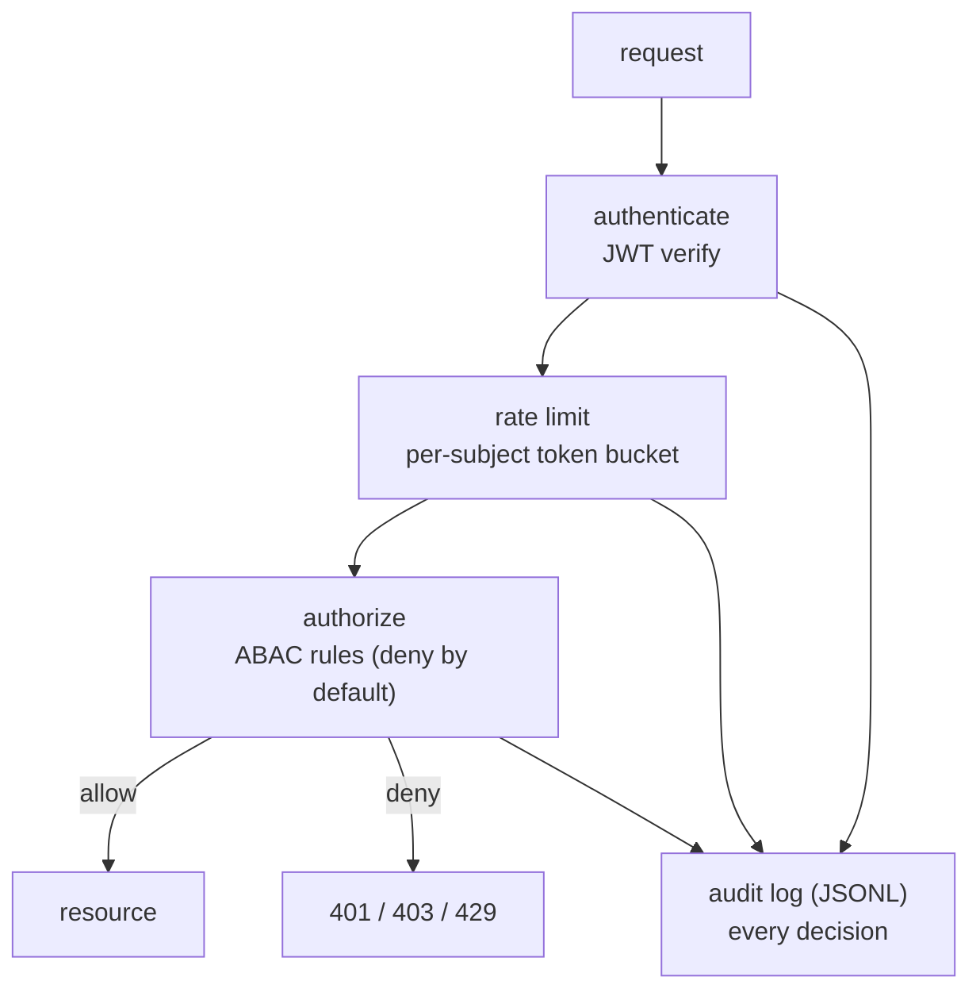

<p align="center">
  <h1>🔐 Zero-Trust Auth Demo</h1>
  <p><b>JWT · ABAC policy engine · rate limiting · append-only audit</b></p>
  <p>
    <a href="https://github.com/akarales/zero-trust-auth-demo/actions/workflows/ci.yml"></a>
    
    
    
    
  </p>
</p>

Security architecture in miniature: every request is **authenticated**
(JWT), **authorized** by an attribute-based policy engine (**ABAC** —
attributes, not just roles; deny by default), **rate-limited** per
subject, and written to an **append-only audit log** — even the audit
tail is policy-protected. Rust (axum) with pure, unit-tested policy logic.

**Jump to:** [Features](#-features) · [Architecture](#-architecture) · [Quickstart](#-quickstart) · [Configuration](#️-configuration) · [API](#-api) · [Docs](#-documentation) · [Roadmap](#️-roadmap)

> [!WARNING]
> Demo application — not a production identity provider. The demo JWT
> secret is compiled in; real deployments feed it from the environment.

## ⚡ Features

- **ABAC policy engine** — ordered rules over subject (role, department),
  action, resource (kind, owning department); first match wins;
  **deny by default**; 6 unit tests cover every rule
- **JWT with attributes** — typed claims carry the ABAC inputs
  (jsonwebtoken 11, HS256 ≥ 32-byte keys, ES256 + rotation on the
  roadmap)
- **Token-bucket rate limiting** — per subject; bursts limited, clients
  isolated, refills restored (tested)
- **Audit-everything** — every decision (allow, deny, rate-limited)
  becomes a JSONL record; the audit endpoint itself is auditor-only by
  policy
- **8 end-to-end flow tests** — 401 / 403 / 429 paths all exercised

## 📐 Architecture



## 🚀 Quickstart

```bash
cargo run    # :8011

# Issue a demo token
curl -X POST localhost:8011/auth/token -H 'content-type: application/json' \
  -d '{"user":"ada","role":"physician","department":"cardiology"}'

# Use it (allowed — same department)
curl localhost:8011/api/v1/records/cardio-patient-1 \
  -H "Authorization: Bearer <token>"
```

Cross-department physician → `403` · no token → `401` · burst → `429`.

## ⚙️ Configuration

| Variable | Default | Notes |
|----------|---------|-------|
| `APP_PORT` | `8011` | 8000–8010 taken on this machine |
| `APP_JWT_SECRET` | compiled demo value | env-provide 32+ bytes in real deployments |

## 📡 API

| Endpoint | Purpose |
|----------|---------|
| `GET /health` | liveness |
| `POST /auth/token` | demo IdP — issue a token |
| `GET/PUT/PATCH /api/v1/records/{id}` | ABAC-protected read/write/approve |
| `GET /api/v1/audit` | audit tail (auditor-only by policy) |

The policy table and payloads: [docs/API.md](docs/API.md).

## 📚 Documentation

| Page | What's inside |
|------|---------------|
| [docs/ARCHITECTURE.md](docs/ARCHITECTURE.md) | The policy rulebook, the request pipeline, rate limiter design |
| [docs/API.md](docs/API.md) | Token issue, protected records, audit access + error taxonomy |
| [docs/DEVELOPMENT.md](docs/DEVELOPMENT.md) | Setup, testing, changing policy safely |

## 🗺️ Roadmap

<details>
<summary>Phased plan</summary>

- [x] Phase 0 — scaffold: JWT, ABAC, rate limits, audit, CI
- [ ] Phase 1 — Redis-backed rate limiting + refresh tokens; ES256 keys
- [ ] Phase 2 — policy-as-file (external policy document, hot reload)
- [ ] Phase 3 — Postgres subjects/departments; WAF-style request rules

</details>

## 🤝 Contributing

PRs welcome — see [CONTRIBUTING.md](CONTRIBUTING.md). Gates: `cargo
clippy --all-targets -- -D warnings`, `cargo test -q`.

## 📄 License

MIT — see [LICENSE](LICENSE).
